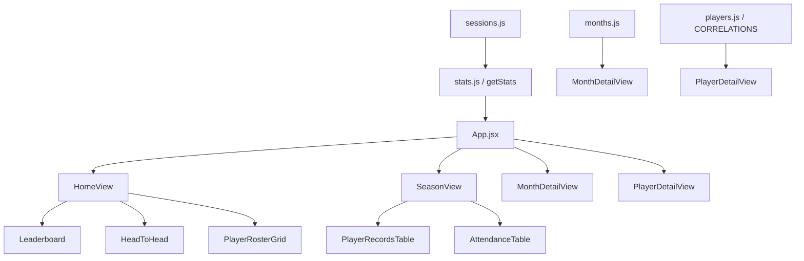

# Morning Hoops — Full Redesign Plan

**Date:** 2026-05-28  
**Status:** Draft — awaiting approval  
**Scope:** Full UI/UX redesign. All existing data, content, editorial voice, and functionality retained. Zero data loss.  
**Files in scope:** `morning_hoops.jsx`, `index.html`, `DESIGN.md`, `src/main.jsx`, new component files  
**Files NOT modified:** `PRODUCT.md`, `scripts/*`, `src/lib/fallbackData.js`, `src/lib/sheetLoader.js`, `src/lib/useSessions.js`

---

## 1. Current State Assessment

### 1.1 Architecture

The entire application lives in a single 1,200-line file — [`morning_hoops.jsx`](morning_hoops.jsx:1). It contains:

- **76 hardcoded session objects** (`SESSIONS` array, lines 8–77)
- **3 month narrative objects** (`MONTHS` array, lines 80–99)
- **17 player profile objects** (`CORRELATIONS` array, lines 101–118)
- **A stats engine** ([`getStats()`](morning_hoops.jsx:123), ~105 lines of aggregation logic)
- **A week-grouping utility** ([`groupSessionsByWeek()`](morning_hoops.jsx:229))
- **2 small presentational components** ([`Badge`](morning_hoops.jsx:249), [`Dot`](morning_hoops.jsx:255))
- **1 monolithic `App` component** ([`export default function App()`](morning_hoops.jsx:265), ~930 lines) containing all state, rendering logic, inline styles, and layout

Every style is inline. There are no CSS files, no CSS modules, no styled-components. The design system tokens in [`index.html`](index.html:13) are consumed via `var()` in inline style objects.

### 1.2 Navigation & Information Architecture

Current tab structure:

```
[ Summary ] [ Season ] [ March ] [ April ] [ May ]
```

- **Summary** — headline stats, top 5 win rates, partnerships, rivalries, Florida Investigation, bottom records
- **Season** — everything from Summary plus full player records, player profiles, attendance table, Tyler Losses, 7/7 Club, Dynasty, Algorithm Matchup — all on one extremely long scrollable page with a section-jump nav
- **March / April / May** — month commentary + week-by-week game logs

The Season tab is the problem child: it's a ~15-screen vertical scroll with 9 distinct sections, an internal jump nav, and no visual hierarchy between sections. The Summary tab duplicates several Season sections. The month tabs are well-structured but isolated from their stats.

### 1.3 Visual Design

The current design follows [`DESIGN.md`](DESIGN.md:1):

- Dark-first, flat (no shadows), tonal depth via 3-tier background stack
- Ember Orange (#EF6234) accent for editorial voice
- Instrument Serif + Outfit typography pairing
- Team Blue (#5B8DEF) / Team Slate (#B4BCD0) for team identity
- Green/Gold/Red three-tier stat coloring
- Cards with 14px radius, 6% opacity borders
- Editorial callout cards with tinted borders for special sections

**What works:** The color palette, typography pairing, and editorial voice are strong. The dark-first approach matches the product context (phones at 5 AM).

**What doesn't work:**
- Visual monotony: every section looks the same — label → card → rows → repeat
- No visual breathing room between major content blocks
- The Season tab is an undifferentiated wall of cards
- Stat presentations are text-heavy with tiny progress bars as the only visualization
- Player profiles are dense text blocks with no visual anchor
- No visual storytelling (the editorial voice carries all the personality; the layout is generic)

### 1.4 Content Inventory (Must Retain)

| Content Block | Data Source | Current Location |
|---|---|---|
| 76 session records (rosters, scores, notes) | `SESSIONS[]` | Summary, Season, Month tabs |
| 3 month narratives (name, commentary, insight) | `MONTHS[]` | Month tabs |
| 17 player profiles (tag, desc, roast) | `CORRELATIONS[]` | Season tab |
| Computed: per-player W-L, attendance, team splits | `getStats()` | Summary + Season |
| Computed: best/worst partnerships (min 3 series) | `getStats()` | Summary + Season |
| Computed: top rivalries | `getStats()` | Summary + Season |
| Computed: algorithm matchup | inline in `renderSeason()` | Season tab |
| Editorial: Florida Investigation | inline JSX | Summary tab |
| Editorial: Tyler Losses Files + Analyst Findings | inline JSX | Season tab |
| Editorial: 7/7 Club (Gabe, Tyler, Lee) | inline JSX | Season tab |
| Editorial: The Dynasty (Nathan, Wags, Lee, Cal) | inline JSX | Season tab |
| Head-to-head record (Blue vs White) | computed | Summary + Season |
| Score distribution (sweeps, blowouts, etc.) | computed | Season tab |
| Series/Games toggle for win rates | `statsMode` state | Summary + Season |

**Every item above must appear in the redesign.** Content may be reorganized across views but nothing is removed.

---

## 2. Redesign Vision

### 2.1 North Star

> **"A sports magazine you can scroll through at 5 AM."**

The current app reads like a newspaper column. The redesign evolves it into a **digital sports magazine** — still editorial, still irreverent, but with the visual rhythm, pacing, and hierarchy of a well-designed longform publication. Think *The Athletic* meets a group chat, not ESPN.

### 2.2 Key Design Shifts

| Current | Redesigned |
|---|---|
| Tab-based flat navigation | Single scrollable home + detail overlays |
| Monolithic Season mega-page | Focused sections with clear entry points |
| Text-heavy stat presentations | Visual-first stats with editorial context below |
| Identical card containers for all content | Distinct section treatments (hero, data table, editorial callout, gallery) |
| Player profiles as text blocks | Player cards with visual identity (initials, color-coded records) |
| Inline editorial notes below game rows | Promoted editorial moments with distinct visual treatment |
| Static progress bars only | Richer stat visualizations (bar charts, win streaks, head-to-head visuals) |

### 2.3 Design Principles (Unchanged from PRODUCT.md)

1. The writing is the product
2. Specific beats general
3. Obsessive detail, casual delivery
4. Entertainment first, stats second
5. Dark gym energy

### 2.4 Design Constraints (Unchanged from DESIGN.md)

- No shadows (flat tonal depth only)
- No new accent colors (Ember Orange remains singular)
- No fantasy-app or SaaS-dashboard aesthetics
- Instrument Serif + Outfit typography pairing
- Dark mode primary, light mode secondary
- Mobile-first

---

## 3. New Information Architecture

### 3.1 Navigation Model

Replace the flat 5-tab system with a **hub-and-spoke** model:

```
┌─────────────────────────────────────────────┐
│              HOME (scrollable)               │
│  ┌─────────────────────────────────────────┐ │
│  │  Hero: Season headline stats            │ │
│  │  Blue 27 — White 18 | 3 months deep     │ │
│  ├─────────────────────────────────────────┤ │
│  │  Quick Stats Grid                       │ │
│  │  4 stat pills: wins, sweeps, avg, etc   │ │
│  ├─────────────────────────────────────────┤ │
│  │  Leaderboard: Top 5 win rates           │ │
│  │  with series/games toggle               │ │
│  ├─────────────────────────────────────────┤ │
│  │  Month Cards (Mar / Apr / May)          │ │
│  │  Tappable — opens month detail          │ │
│  ├─────────────────────────────────────────┤ │
│  │  Featured Editorial                     │ │
│  │  rotating: Florida / Dynasty / 7-7 Club │ │
│  ├─────────────────────────────────────────┤ │
│  │  Player Grid                            │ │
│  │  Avatar initials + record + tag         │ │
│  │  Tappable — opens player detail         │ │
│  ├─────────────────────────────────────────┤ │
│  │  Bottom CTA: Full Season Records ↓      │ │
│  └─────────────────────────────────────────┘ │
│                                               │
│  DETAIL VIEWS (overlay/slide-in panels):      │
│  ┌────────────┐  ┌────────────┐              │
│  │ Month View │  │ Player     │              │
│  │ (Mar/Apr/  │  │ Detail     │              │
│  │  May)      │  │            │              │
│  ├────────────┤  ├────────────┤              │
│  │ Full       │  │ Matchups & │              │
│  │ Season     │  │ Partner-   │              │
│  │ Records    │  │ ships      │              │
│  └────────────┘  └────────────┘              │
└─────────────────────────────────────────────┘
```

**Rationale:** The current Summary and Season tabs overlap heavily. Month tabs are isolated. The hub-and-spoke model lets the home page be a curated "front page" — the best stats, the best editorial — with deeper content accessible via taps. This matches how the audience actually uses it: open in the group chat, scroll the highlights, tap into something interesting.

### 3.2 View Breakdown

#### 3.2.1 Home View (Default)

The front page. A curated scroll of the season's highlights. Every section is a self-contained editorial unit.

**Sections in order:**

1. **Hero Header** — Title, tagline, season summary line
2. **Head-to-Head Bar** — Blue vs White with the big Instrument Serif numbers
3. **Quick Stats Grid** — 4 stat pills (Blue Wins, White Wins, Sweeps, Avg/Session)
4. **Leaderboard** — Top 5 win rates with series/games toggle (moved from both Summary and Season)
5. **Month Preview Cards** — 3 tappable cards (March, April, May) showing month name, record, and a one-line hook from the commentary. Tap opens month detail.
6. **Featured Editorial Block** — One of: Florida Investigation, Dynasty, 7/7 Club — with a carousel dot or a single featured pick. Rotates or shows the most recent.
7. **Player Roster Grid** — All 17 players as compact cards: initial avatar, name, record, tag. Tappable to open player detail.
8. **Partnerships & Rivalries** — Best/worst partnerships, biggest rivalries (moved from Summary)
9. **Currently Struggling** — Bottom 3 win rates
10. **Footer** — Standard footer text

#### 3.2.2 Month Detail View

Accessed by tapping a month card on the home view. Replaces the current March/April/May tabs.

**Content (all existing):**
- Month name + "The Origin Era" / "The Plot Thickens" / "The Dynasty Returns"
- Blue X — White Y record
- Full commentary paragraph
- Week-by-week game log (existing `renderGame` rows grouped by `renderWeekHeader`)
- Debrief/insight footer

**New additions:**
- Month-specific mini leaderboard (who won the most in that month)
- Back-to-home navigation

#### 3.2.3 Player Detail View

Accessed by tapping a player card on the home view. New — currently player profiles are inline in the Season tab.

**Content (all existing):**
- Player name + tag
- W-L record (series) + win percentage
- Individual game record
- Full profile description (`desc` field)
- Scouting Report / roast (`roast` field)

**New additions:**
- Best teammate / worst teammate (from `teammateReport()` — already computed but never displayed)
- Recent results (last 5 sessions the player appeared in)
- Team distribution (how often Blue vs White)
- Visual record indicator (not just a number — a small bar or dot sequence)

#### 3.2.4 Full Season View

Accessed via a "Full Season Records" link at the bottom of the home view, or via a persistent nav item. Replaces the current Season tab.

**Content (all existing, reorganized):**
- Head-to-Head overview with score distribution
- Full player records table (all players, not just top 5)
- Attendance table
- Tyler Losses Files + Analyst Findings
- 7/7 Club
- The Dynasty
- Algorithm Matchup

**Key change:** This becomes the "deep dive" — accessed intentionally, not the default view. The home page surfaces the highlights; this page has the full dataset.

### 3.3 Navigation Implementation

```
┌──────────────────────────────────────────┐
│  STICKY HEADER (slim)                    │
│  🏀 Morning Hoops          [☀️/🌙]      │
├──────────────────────────────────────────┤
│  BOTTOM TAB BAR (mobile) or             │
│  INLINE NAV (desktop)                    │
│  [ Home ] [ Season ] [ Players ]         │
└──────────────────────────────────────────┘
```

- **3 primary nav items** instead of 5 tabs: Home, Season, Players
- Month views are accessed from within Home (month cards) or Season
- Player details are accessed from the Players grid or Home roster
- On mobile: bottom tab bar (thumb-friendly). On desktop: pills in the header area.
- The sticky tab bar moves from top to bottom on mobile for better thumb reach

---

## 4. Component Architecture

### 4.1 File Structure

Break the monolith into focused modules:

```
src/
├── main.jsx                          # Entry point (existing)
├── App.jsx                           # Root layout + routing + theme
├── data/
│   ├── sessions.js                   # SESSIONS array (extracted)
│   ├── months.js                     # MONTHS array (extracted)
│   └── players.js                    # CORRELATIONS array (extracted)
├── lib/
│   ├── stats.js                      # getStats() + groupSessionsByWeek()
│   ├── theme.js                      # Theme tokens (t object), dark/light
│   ├── useSessions.js                # Existing
│   ├── sheetLoader.js                # Existing
│   └── fallbackData.js               # Existing
├── components/
│   ├── layout/
│   │   ├── Header.jsx                # Slim sticky header
│   │   ├── NavBar.jsx                # Bottom tab bar (mobile) / inline (desktop)
│   │   ├── Footer.jsx                # Footer text
│   │   └── SectionDivider.jsx        # Thin rule + editorial divider
│   ├── ui/
│   │   ├── Badge.jsx                 # Win/loss badge (existing)
│   │   ├── Dot.jsx                   # Team color dot (existing)
│   │   ├── StatPill.jsx              # Stat value + label in inset box
│   │   ├── ProgressBar.jsx           # Reusable progress bar with ARIA
│   │   ├── PlayerAvatar.jsx          # Initials circle with tier color
│   │   ├── RecordBadge.jsx           # W-L with tier color
│   │   ├── TogglePill.jsx            # Series/Games mode toggle
│   │   └── ThemeToggle.jsx           # Dark/light switch
│   ├── home/
│   │   ├── HomeView.jsx              # Home page composition
│   │   ├── HeroHeader.jsx            # Title + tagline + season line
│   │   ├── HeadToHead.jsx            # Blue vs White big numbers + bar
│   │   ├── QuickStats.jsx            # 4-stat grid
│   │   ├── Leaderboard.jsx           # Top 5 with toggle
│   │   ├── MonthPreviewCard.jsx      # Tappable month summary card
│   │   ├── FeaturedEditorial.jsx     # Florida / Dynasty / 7-7 highlight
│   │   ├── PlayerRosterGrid.jsx      # Compact player cards grid
│   │   └── PartnershipsRivalries.jsx # Best/worst pairs + rivals
│   ├── season/
│   │   ├── SeasonView.jsx            # Full season composition
│   │   ├── PlayerRecordsTable.jsx    # Full W-L table (series + games)
│   │   ├── AttendanceTable.jsx       # Full attendance breakdown
│   │   ├── TylerLosses.jsx           # Tyler Losses Files editorial
│   │   ├── SevenSevenClub.jsx        # 7/7 Club section
│   │   ├── DynastySection.jsx        # Dynasty editorial
│   │   └── AlgorithmMatchup.jsx      # Computed matchup section
│   ├── month/
│   │   ├── MonthDetailView.jsx       # Month detail page
│   │   ├── GameRow.jsx               # Single game row (compact/regular/wide)
│   │   └── WeekHeader.jsx            # Week separator with tally
│   └── player/
│       ├── PlayerDetailView.jsx      # Player detail page
│       ├── PlayerProfile.jsx         # Name, tag, record, description
│       ├── PlayerStats.jsx           # Detailed stats breakdown
│       └── PlayerRoast.jsx           # Scouting Report callout
└── styles/
    └── tokens.css                    # CSS custom properties (from index.html)
```

### 4.2 Data Flow



### 4.3 State Management

Keep it simple — React state + prop drilling. No external state library needed.

```
App.jsx state:
  - view: 'home' | 'season' | 'month' | 'player'
  - selectedMonth: string | null
  - selectedPlayer: string | null
  - statsMode: 'series' | 'games'
  - dark: boolean
  - bp: 'compact' | 'regular' | 'wide'
```

Navigation uses internal state, not a router. View transitions can use simple conditional rendering with CSS transitions for slide-in effects.

---

## 5. Visual Design Changes

### 5.1 Layout Rhythm

**Current:** Label → Card → Label → Card → Label → Card (uniform spacing)

**Redesigned:** A magazine-style rhythm with varied section treatments:

```
┌─────────────── HERO (full-bleed, no card) ──────────────┐
│  Morning Hoops                                           │
│  4:45 AM · Middle School Gym · 3 Months Deep             │
│  27-18 Blue · 45 decided series · 17 players             │
└──────────────────────────────────────────────────────────┘

┌─── HEAD-TO-HEAD (accent-bordered hero card) ────────────┐
│        27              vs              18                 │
│      BLUE                           WHITE                │
│  ████████████████████░░░░░░░░░░░                         │
│  Sweeps: 8 · Blowouts: 7 · Nail-biters: 14              │
└──────────────────────────────────────────────────────────┘

      [ stat ]  [ stat ]  [ stat ]  [ stat ]
       Blue 27   White 18  Sweeps 8  Avg 8.2

┌─── LEADERBOARD (data card, no padding overflow) ────────┐
│  TOP 5 WIN RATES          [Series] [Games]               │
│  1  Cal         22-9    ████████████████░░  71%          │
│  2  Tyler       16-7    ███████████████░░░  70%          │
│  ...                                                     │
└──────────────────────────────────────────────────────────┘

  ┌── MARCH ──┐  ┌── APRIL ──┐  ┌── MAY ────┐
  │ Origin    │  │ Plot      │  │ Dynasty   │
  │ Era       │  │ Thickens  │  │ Returns   │
  │ B10-W7    │  │ B11-W6    │  │ B5-W2     │
  │ →         │  │ →         │  │ →         │
  └───────────┘  └───────────┘  └───────────┘

┌─── FEATURED EDITORIAL (tinted callout) ─────────────────┐
│  🏆 THE DYNASTY                                          │
│  Nathan · Wags · Lee · Cal                               │
│  Reunited on 5/4. Won 4-2. Won the tournament.          │
│  The trophy is non-negotiable.                           │
└──────────────────────────────────────────────────────────┘

  ┌─ Cal ─┐  ┌─ Tyler ┐  ┌─ Nathan ┐  ┌─ Gabe ─┐
  │  CL   │  │   TY   │  │   NA    │  │   GA   │
  │ 22-9  │  │ 16-7   │  │ 26-15   │  │ 21-14  │
  │ 71%   │  │ 70%    │  │ 63%     │  │ 60%    │
  └───────┘  └────────┘  └─────────┘  └────────┘
  (scrollable grid of all 17 players)
```

### 5.2 Section Treatment Hierarchy

Instead of uniform cards, use **4 distinct section treatments**:

| Treatment | Used For | Visual |
|---|---|---|
| **Hero** | Page header, H2H overview | No card border. Full-width. Large serif type. Breathes. |
| **Data Card** | Leaderboard, records table, attendance, partnerships | Card container with `padding: 0, overflow: hidden`. Internal rows bleed to edges. Header row with inset background. |
| **Editorial Callout** | Florida Investigation, Tyler Losses, 7/7 Club, Dynasty | Tinted border + tinted background. Left accent bar. Distinct from data cards. |
| **Gallery** | Month preview cards, player roster grid | Grid of smaller cards. Tappable. Hover/press effects. Visual entry points to detail views. |

### 5.3 Player Avatar Component

New visual element — initials in a colored circle. Provides visual anchor for player cards and detail views.

```
    ┌────┐
    │ CL │  ← 2-letter initials
    └────┘
     Cal
    22-9 · 71%
    Flamethrower
```

- Circle background uses the three-tier stat color (green/gold/red) based on win rate
- Initials are first two letters of the name (or first letter of first + last for two-word names)
- Size: 48px on compact, 56px on regular, 64px on wide
- This replaces the current "big serif number on the left, text on the right" profile layout

### 5.4 Month Preview Cards

New gallery-style entry points for month detail views:

```
┌─────────────────────────┐
│  MARCH                  │
│  The Origin Era         │  ← Instrument Serif
│                         │
│  Blue 10 — White 7      │
│  21 sessions · 4 sweeps │
│                         │
│  "The month it all      │
│   began..."       →     │  ← one-line hook
└─────────────────────────┘
```

- Card background: subtle gradient or tinted inset
- Tap navigates to the full month detail view
- On compact: horizontal scroll (1 card visible + peek of next)
- On regular: 2-up grid
- On wide: 3-up grid

### 5.5 Navigation Redesign

**Mobile (< 768px): Bottom Tab Bar**

```
┌────────────────────────────────────────┐
│                                        │
│          (scrollable content)          │
│                                        │
├────────────────────────────────────────┤
│  [ 🏠 Home ]  [ 📊 Season ]  [ 👤 Players ] │
└────────────────────────────────────────┘
```

- Fixed to bottom, safe-area-inset aware
- 3 items: Home, Season, Players
- Active item uses Ember Orange text
- Height: 56px + safe-area-inset-bottom
- Replaces the current sticky top tab bar

**Desktop (≥ 768px): Inline Header Nav**

```
┌──────────────────────────────────────────────────┐
│  🏀 Morning Hoops     [ Home ] [ Season ] [ Players ]  [🌙] │
└──────────────────────────────────────────────────┘
```

- Slim header with title left, nav center/right, theme toggle far right
- Pill-style active indicator (existing pattern)
- Not sticky — scrolls away. Content is the star, not the chrome.

### 5.6 Typography Refinements

No new fonts. Refine the existing scale:

| Element | Current | Redesigned |
|---|---|---|
| Page title | `clamp(32px, 5.5vw, 56px)` | Same — works well |
| Section label | `clamp(10px, 1.4vw, 11px)` uppercase | Bump to `clamp(11px, 1.5vw, 12px)` — slightly more readable |
| Player name in grid | `13px` body weight 700 | `clamp(14px, 2vw, 16px)` — names deserve prominence in the roster |
| Editorial callout intro | Same as body | Bump to `--type-body` with weight 500 and `--type-body-lh: 1.7` for better readability |
| Game note (editorial) | `--type-label` in Ember italic | Keep — this is a signature element |

### 5.7 Micro-Interactions

All respect `prefers-reduced-motion`. All use `transform` + `opacity` (GPU-composited).

| Interaction | Element | Effect |
|---|---|---|
| Tap/press | All tappable cards (month, player, nav) | `scale(0.97)` at 120ms |
| Hover (desktop only) | Stat pills, gallery cards | `scale(1.02)` at 200ms |
| View transition | Home → Month detail | Slide-in from right (300ms ease-out) |
| View transition | Home → Player detail | Slide-up overlay (300ms ease-out) |
| Tab switch | Bottom nav items | Crossfade content (200ms) |

### 5.8 Color Palette (Unchanged)

The existing palette from [`DESIGN.md`](DESIGN.md:109) is retained in full:

- Ember Orange `#EF6234` — editorial voice accent
- Team Blue `#5B8DEF` / `#3B6BF5` — blue team
- Team Slate `#B4BCD0` / `#64748B` — white team
- Stat Green `#34D399`, Stat Gold `#FBBF24`, Stat Red `#F87171`
- Dark surfaces: `#09090B` / `#16161A` / `#0D0D0F`
- Light surfaces: `#F7F6F3` / `#FFFFFF` / `#EDECEB`

No new colors introduced. The Ember Rule and Three-Tier Stat Rule remain in effect.

---

## 6. Section-by-Section Redesign Specifications

### 6.1 Home View — Hero Header

**Current:** Title + subtitle + tagline in a flex row with theme toggle

**Redesigned:**

```jsx
// Hero — full width, no card, generous vertical spacing
<header>
  <div>4:45 AM · MIDDLE SCHOOL GYM · 3 MONTHS DEEP</div>     {/* label */}
  <h1>Morning <em>Hoops</em></h1>                              {/* display */}
  <p>A group of grown adults wake up before the sun...</p>      {/* body */}
  <div>                                                         {/* stat summary line */}
    <span>45 series</span> · <span>17 players</span> · <span>Blue leads 27-18</span>
  </div>
</header>
```

- The stat summary line is **new** — a scannable one-liner below the tagline
- Theme toggle moves to the nav area (header on desktop, settings on mobile)
- No card container — this breathes at full width

### 6.2 Home View — Head-to-Head

**Current:** Card with big numbers + progress bar + 4 stat chips

**Redesigned:** Same content, elevated treatment:

- On compact: centered vertical stack (existing pattern works well)
- On regular+: horizontal with larger number treatment
- **New:** Add score distribution chips inline below the bar (Sweeps / Blowouts / Comfortable / Nail-biters) — currently these only appear on the Season tab. Moving them here surfaces interesting data earlier.

### 6.3 Home View — Leaderboard

**Current:** "Top 5 Win Rates" section in both Summary and Season tabs

**Redesigned:** Single Leaderboard component used on Home view:

- Retains the series/games toggle
- Uses the existing stacked-row compact layout and grid regular+ layout
- Adds a "View all records →" link that navigates to Season view's full table
- The "Currently Struggling" bottom-3 section becomes a toggle or second tab within the leaderboard: `[Top 5] [Bottom 3]`

### 6.4 Home View — Month Preview Cards

**New section.** Currently months are separate tabs. Now they're gallery cards:

- 3 cards in a horizontal scroll (compact) or grid (regular+)
- Each shows: month label, editorial name, Blue-White record, session count, one-line hook
- Tap opens MonthDetailView
- Card uses the inset background with a subtle team-color accent (blue tint for Blue-winning months)

### 6.5 Home View — Featured Editorial

**Current:** Florida Investigation is in Summary; Dynasty, 7/7 Club, Tyler Losses are in Season

**Redesigned:** A single editorial spotlight on the home page. Show one featured section at a time — the most visually interesting. Suggested default: The Dynasty (it has the most visual structure — roster card, result, tournament).

Other editorial pieces (Florida Investigation, Tyler Losses) are accessible from:
- The Season view (full access to all)
- A "More stories" link below the featured editorial

### 6.6 Home View — Player Roster Grid

**Current:** Player profiles are a long scrollable list in the Season tab

**Redesigned:** A grid of compact player cards on the home page:

- Compact: 2-column grid
- Regular: 3-column grid
- Wide: 4-column grid
- Each card: PlayerAvatar (initials circle) + name + record + tag
- Tap opens PlayerDetailView
- Sorted by win rate descending (winners at the top — entertainment hierarchy)

### 6.7 Player Detail View (New)

**Current:** Player profiles are inline cards in the Season tab with desc + roast

**Redesigned:** A dedicated view for each player:

```
┌─────────────────────────────────────┐
│  ← Back                             │
│                                      │
│         ┌────┐                       │
│         │ CL │  ← avatar             │
│         └────┘                       │
│          Cal                         │
│     Flamethrower / Dynasty           │
│                                      │
│     ┌──────┐ ┌──────┐ ┌──────┐     │
│     │ 22-9 │ │ 71%  │ │ 31g  │     │  stat pills
│     │ W-L  │ │ Win% │ │ Played│     │
│     └──────┘ └──────┘ └──────┘     │
│                                      │
│  PROFILE                             │
│  22-9 lifetime, best win rate...     │
│                                      │
│  🔥 SCOUTING REPORT                  │
│  71% win rate. Highest in the...     │
│                                      │
│  BEST TEAMMATE                       │
│  Nathan (8-2 together, 80%)          │
│                                      │
│  WORST TEAMMATE                      │
│  Mike (2-5 together, 29%)            │
│                                      │
│  RECENT RESULTS                      │
│  W 5/28 · W 5/27 · L 5/25 · ...     │
│                                      │
│  TEAM SPLIT                          │
│  Blue: 18 appearances                │
│  White: 13 appearances               │
└─────────────────────────────────────┘
```

**New data surfaced:**
- Best/worst teammate — already computed by `teammateReport()` but never displayed in the current UI
- Recent results — last 5 sessions with W/L indicator
- Team split — Blue vs White appearance count (already in stats as `bt`/`wt`)

### 6.8 Month Detail View

**Current:** Month tabs with commentary + week-by-week game log

**Redesigned:** Same content, improved entry/exit:

- Accessed by tapping a month card, not a tab
- Has a clear "← Back to Home" navigation
- Month-specific mini leaderboard added at the top (best record that month)
- Game rows, week headers, editorial notes, and debrief section all retained as-is
- The existing responsive game row layouts (compact inline, regular stacked, wide 5-col grid) are kept

### 6.9 Season View — Full Records

**Current:** The Season tab is a mega-scroll with 9 sections

**Redesigned:** Focused on the data-heavy sections:

**Sections in order:**
1. Head-to-Head with score distribution (existing)
2. Full Player Records table with series/games toggle (existing)
3. Attendance table (existing)
4. Best/Worst Partnerships (moved from home for the full versions)
5. Biggest Rivalries (moved from home for the full version)
6. Tyler Losses Files + Analyst Findings (existing)
7. 7/7 Club (existing)
8. The Dynasty (existing)
9. Algorithm Matchup (existing)

The section-jump nav is retained but improved:
- Sticky at top (below header on desktop, above bottom bar on mobile)
- Horizontal scroll with fade-hint mask
- Better touch targets (44px minimum, already specified in DESIGN.md 7.3.3)

### 6.10 Full Game Log (within Month Detail)

Existing game row rendering is retained across all three breakpoints. The editorial notes below game rows are kept with their current Ember accent styling.

**One improvement:** For "no game" rows, add a more distinct visual treatment — currently they're just reduced opacity. Make them a single-line italic note without the roster grid structure, saving vertical space.

---

## 7. Implementation Phases

### Phase 1 — Foundation: Extract & Restructure

Extract data and logic from the monolith. No visual changes yet.

- [ ] Create `src/data/sessions.js` — move `SESSIONS` array from [`morning_hoops.jsx`](morning_hoops.jsx:8)
- [ ] Create `src/data/months.js` — move `MONTHS` array from [`morning_hoops.jsx`](morning_hoops.jsx:80)
- [ ] Create `src/data/players.js` — move `CORRELATIONS` array from [`morning_hoops.jsx`](morning_hoops.jsx:101)
- [ ] Create `src/lib/stats.js` — move [`getStats()`](morning_hoops.jsx:123) and [`groupSessionsByWeek()`](morning_hoops.jsx:229)
- [ ] Create `src/lib/theme.js` — extract theme token object (`t`) and theme logic
- [ ] Create `src/styles/tokens.css` — move CSS custom properties from [`index.html`](index.html:13) into a dedicated file imported by `main.jsx`
- [ ] Verify the app still works identically after extraction

### Phase 2 — Component Library: UI Primitives

Build the reusable components. Test them in isolation.

- [ ] Create `src/components/ui/Badge.jsx` — extract from [`morning_hoops.jsx:249`](morning_hoops.jsx:249)
- [ ] Create `src/components/ui/Dot.jsx` — extract from [`morning_hoops.jsx:255`](morning_hoops.jsx:255)
- [ ] Create `src/components/ui/StatPill.jsx` — new component (see 5.1)
- [ ] Create `src/components/ui/ProgressBar.jsx` — extract inline progress bars, add ARIA
- [ ] Create `src/components/ui/PlayerAvatar.jsx` — new component (see 5.3)
- [ ] Create `src/components/ui/RecordBadge.jsx` — new component
- [ ] Create `src/components/ui/TogglePill.jsx` — extract series/games toggle
- [ ] Create `src/components/ui/ThemeToggle.jsx` — extract theme toggle button
- [ ] Create `src/components/layout/SectionDivider.jsx` — extract from inline pattern
- [ ] Create `src/components/layout/Footer.jsx` — extract footer

### Phase 3 — Views: Home

Build the home view as the new default.

- [ ] Create `src/App.jsx` — root component with view routing and nav
- [ ] Create `src/components/layout/Header.jsx` — slim header
- [ ] Create `src/components/layout/NavBar.jsx` — bottom tab bar (mobile) / inline (desktop)
- [ ] Create `src/components/home/HomeView.jsx` — composition of home sections
- [ ] Create `src/components/home/HeroHeader.jsx` — title + tagline + stat line
- [ ] Create `src/components/home/HeadToHead.jsx` — Blue vs White hero stat
- [ ] Create `src/components/home/QuickStats.jsx` — 4-stat grid
- [ ] Create `src/components/home/Leaderboard.jsx` — top 5 with toggle + "view all" link
- [ ] Create `src/components/home/MonthPreviewCard.jsx` — tappable month card
- [ ] Create `src/components/home/FeaturedEditorial.jsx` — editorial spotlight
- [ ] Create `src/components/home/PlayerRosterGrid.jsx` — compact player cards
- [ ] Create `src/components/home/PartnershipsRivalries.jsx` — partnerships + rivalries

### Phase 4 — Views: Month Detail + Player Detail

Build the detail views.

- [ ] Create `src/components/month/MonthDetailView.jsx` — month detail composition
- [ ] Create `src/components/month/GameRow.jsx` — extract game row rendering
- [ ] Create `src/components/month/WeekHeader.jsx` — extract week header
- [ ] Create `src/components/player/PlayerDetailView.jsx` — player detail composition
- [ ] Create `src/components/player/PlayerProfile.jsx` — name, tag, record, desc
- [ ] Create `src/components/player/PlayerStats.jsx` — stat pills + teammate report + team split
- [ ] Create `src/components/player/PlayerRoast.jsx` — scouting report callout

### Phase 5 — Views: Season (Full Records)

Rebuild the Season view with the reorganized sections.

- [ ] Create `src/components/season/SeasonView.jsx` — season composition with section jump nav
- [ ] Create `src/components/season/PlayerRecordsTable.jsx` — full W-L table
- [ ] Create `src/components/season/AttendanceTable.jsx` — attendance breakdown
- [ ] Create `src/components/season/TylerLosses.jsx` — Tyler Losses editorial
- [ ] Create `src/components/season/SevenSevenClub.jsx` — 7/7 Club section
- [ ] Create `src/components/season/DynastySection.jsx` — Dynasty editorial
- [ ] Create `src/components/season/AlgorithmMatchup.jsx` — computed matchup

### Phase 6 — Polish & Transitions

Final visual polish and interaction refinements.

- [x] Add view transition animations (slide-in, crossfade)
- [x] Add press/hover micro-interactions
- [x] Verify all WCAG AA contrast pairs
- [x] Verify all touch targets are ≥ 44px
- [x] Test on compact (375px), regular (480px), wide (768px+) breakpoints
- [x] Test dark and light modes
- [x] Test with `prefers-reduced-motion: reduce`
- [x] Update [`DESIGN.md`](DESIGN.md:1) to reflect the new component architecture and navigation model
- [x] Remove the old monolithic [`morning_hoops.jsx`](morning_hoops.jsx:1) once all content is migrated and verified
- [x] Final content audit: verify every session, every player, every editorial note is present

---

## 8. Content Preservation Checklist

Every item must be verified after implementation:

- [ ] All 76 session records (rosters, scores, notes) render correctly
- [ ] All 3 month narratives (name, commentary, insight) are displayed
- [ ] All 17 player profiles (tag, desc, roast) are accessible
- [ ] All computed stats match current values: per-player W-L, attendance, team splits
- [ ] Best/worst partnerships display correctly (min 3 series threshold)
- [ ] Top rivalries display correctly
- [ ] Algorithm matchup produces same teams
- [ ] Florida Investigation text is present
- [ ] Tyler Losses Files + all 6 Analyst Findings bullet points are present
- [ ] 7/7 Club shows all 3 members with correct dates
- [ ] Dynasty section: roster card, reunion result, tournament text all present
- [ ] Series/Games toggle works on leaderboard and full records
- [ ] Head-to-head numbers match (Blue wins, White wins, sweeps, etc.)
- [ ] Score distribution correct (4-0, 4-1, 4-2, 4-3 counts)
- [ ] Attendance tiers (IRON/REG/PT/DROP/1x) compute correctly
- [ ] All game notes with editorial commentary display in month views
- [ ] All "no game" sessions with notes display correctly
- [ ] Week headers show correct date ranges and win tallies
- [ ] Dark/light theme toggle works and persists to localStorage
- [ ] Theme-color meta tag updates on toggle

---

## 9. What This Plan Does NOT Change

- **No new data or content** — all editorial text, player descriptions, roasts, and notes are retained verbatim
- **No new dependencies** — React 18 + Vite remains the stack. No router, no state library, no CSS framework
- **No backend changes** — remains a static site deployed via GitHub Pages
- **No font changes** — Instrument Serif + Outfit remains the pairing
- **No color changes** — the full palette from DESIGN.md is unchanged
- **No shadow introduction** — remains flat with tonal depth
- **No changes to data pipeline** — `scripts/*`, `src/lib/sheetLoader.js`, `src/lib/useSessions.js`, `src/lib/fallbackData.js` are untouched

---

## 10. Success Criteria

The redesign is successful when:

1. A user opening the app in the group chat can **scan the front page in 10 seconds** and know the season record, who's winning, and what's new
2. Every piece of existing content is **reachable within 2 taps** from the home view
3. The app **feels like a magazine**, not a spreadsheet or a SaaS dashboard
4. Player profiles are **individually addressable** — you can send someone a link to their profile (future: URL routing)
5. The editorial voice is **more prominent**, not less — special sections have distinct visual treatments
6. The monolith is broken into **<200-line component files** that are independently understandable
7. Mobile experience on a 375px phone at 5 AM in a dim gym is **the primary design target**
